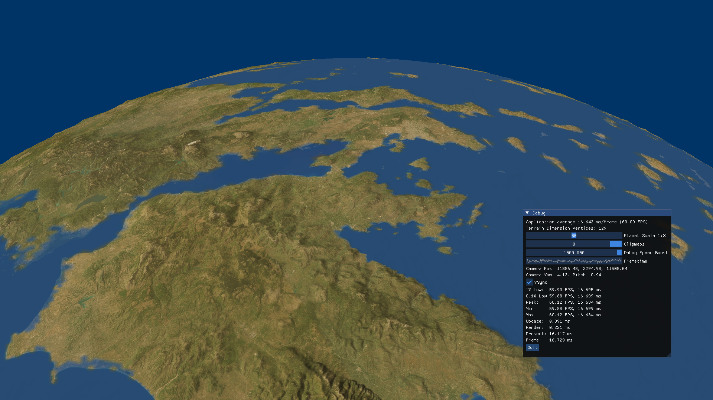

Basic real time 3D renderer using Win32, Direct3D 12 and HLSL in C/C++. Uses Dear ImGui, SDL, stb_image.h.

Instructions: Control camera with WASD and F1 to toggle mouse control.

Features:
- 16-bit heightmaps
- Chunked LOD system
- Adjustable detail range

Screenshots:

